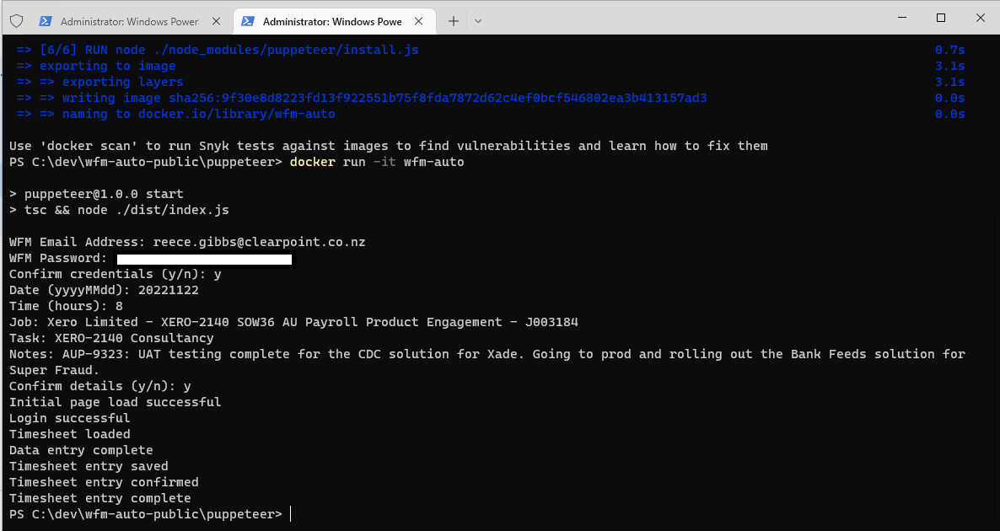

# WFM-Auto Setup Guide

## Overview
WFM-Auto is a Puppeteer flow that automates simple timesheet entries into the WorkflowMax application. The reason we don't use the API for this is because of licensing costs

## Prerequisites
In order to setup the WFM-Auto container on your local machine you will need the following:

- Docker installed on your machine with support for Linux containers
- A Workflow Max account
- The job and task codes relevant to your timesheet entry

## Forking and cloning the repository
You are more than welcome to fork this repository and submit PRs with desired changes to the source code (although it might take a while for them to get approved)

## Building the WFM-Auto Docker image
Once you have cloned the repository to your local machine, follow the steps below to setup and build the WFM-Auto Docker image

- Navigate to the `./puppeteer` directory from the root repo folder
- Run the following command to build the Docker container and setup your WFM credentials for runtime:
    `docker build . -t wfm-auto --build-arg wfm_email="{wfm_email_address}" --build-arg wfm_password="{wfm_password}"`

_NOTE: If your password contains specials characters (e.g. $ in Powershell) you will need to escape these characters when defining your wfm_password_

## Obtaining the Job and Task codes from Workflow Max
Once your Docker image has been built successfully, login to Workflow Max on your browser, navigate to the timesheet entry page like you normally would and copy the `Job` and `Task` codes you need and keep them somewhere on your local machine for quick copy and pasting whenever you want to run a timesheet entry

## Running the WFM-Auto container for the first time
Once you have your `Job` and `Task` codes on hand, you're ready to go

Run the following command in order to run the Docker container for the first time and submit your entry:
`docker run --name wfm-auto -it wfm-auto`

_NOTE: Although your credentials were set at build time, you do have the option to change them at runtime if you please. This will only change the credentials for that particular run however. If you would like to change the persisting credentials in the config, you simply have to rebuild the image with the updated credentials as you did in the steps above_

## Wait for the run to complete
A successful entry looks like this:

You can confirm the entry if you'd like by navigating to WFM on your browser

## Running the container again
For every subsequent timesheet entry, simply run the following command in your terminal:
`docker start -i wfm-auto`

## Note on the performance
The entry might seem like it takes longer than it should. This is because of race condition issues I was having with keyboard entry vs mouse clicks in puppeteer. If you would like to submit a PR with any improvements, that would be greatly appreciated